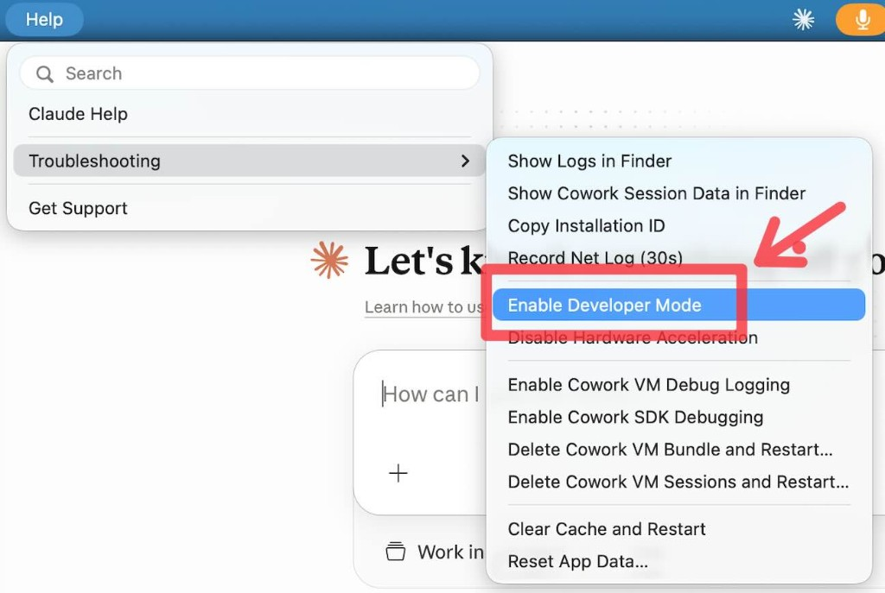
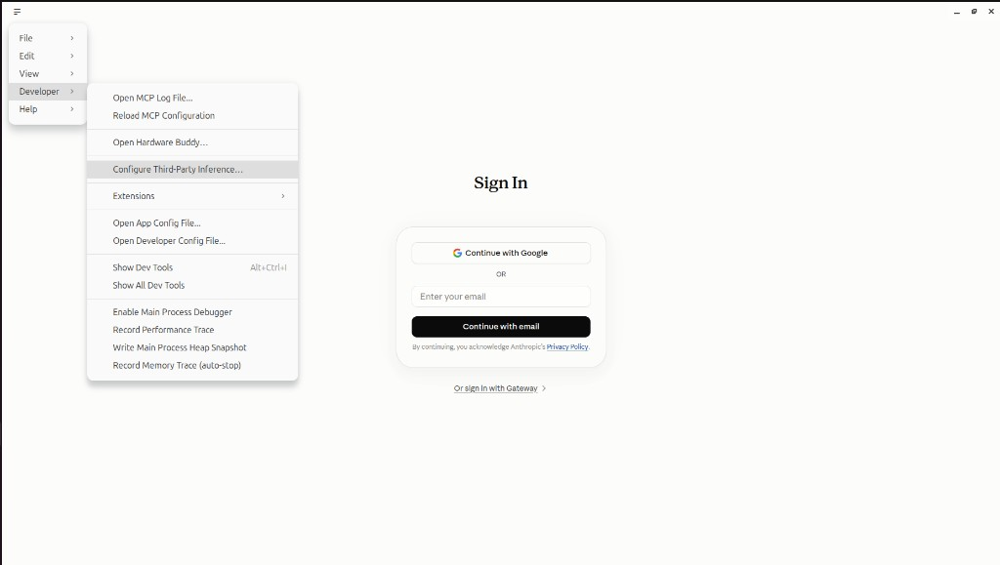
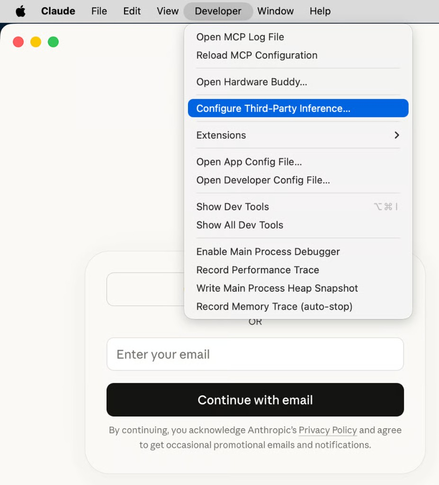

# Claude Desktop Gateway

Go CLI that configures Claude Desktop (3P gateway mode) and runs a local
Anthropic Messages API proxy that routes to OpenRouter, 9router, or any
OpenAI-compatible gateway.

**You only need the binary + an OpenRouter API key.** No repo checkout and no
hand-written config are required: on first run the binary writes the shipped
default `config.toml` to the OS default path (see below).

When the proxy starts it opens a bilingual **EN/FA guide** in your browser
(`http://127.0.0.1:8080/`) and prints that URL in the terminal. Use
`--no-browser` to skip opening a window.

**Setup status:** the terminal prints **READY**, **PARTIAL**, or **NOT READY**
after auto-detecting Claude Desktop (every existing data dir it can find),
picking the next free port if 8080 is busy, and probing the API key. The guide
has the same card. If it is not READY, copy the **support prompt** (secrets
are stripped) and send it to whoever gave you this app — or run
`./claude-gateway doctor --prompt`. A copy is also saved under the gateway
data dir as `last-doctor.txt`.

The guide’s **This session** card shows last-request tokens and estimated
spend; if that card errors, chat still works. Local history, price fetch, and
Desktop apply on start are the same: they warn and continue. `client apply`
still fails hard if it cannot write Desktop config.

---

## Install (binary from GitHub Releases)

Every push to `main` builds Linux, macOS, and Windows binaries and publishes a
**new** GitHub Release tagged `build-<shortsha>`. Install URLs under
`/releases/latest/` always follow the newest of those.

| File | Platform |
|---|---|
| `claude-gateway-linux-amd64` | Linux x86_64 |
| `claude-gateway-linux-arm64` | Linux ARM64 |
| `claude-gateway-darwin-arm64` | macOS Apple Silicon (M1/M2/M3/…) |
| `claude-gateway-darwin-amd64` | macOS Intel |
| `claude-gateway-windows-amd64.exe` | Windows x86_64 |
| `claude-gateway-windows-arm64.exe` | Windows ARM64 |

Default config written on first run:

| OS | Path |
|---|---|
| Windows | `%APPDATA%\claude-gateway\config.toml` |
| macOS / Linux | `~/.config/claude-gateway/config.toml` |

Claude Desktop config apply targets (newest layout first; apply writes the one
that already exists, or the current official path if none do):

| OS | 3P path |
|---|---|
| Windows (current) | `%LOCALAPPDATA%\Claude-3p\claude_desktop_config.json` plus `configLibrary\` |
| Windows (MSIX / Store) | `%LOCALAPPDATA%\Packages\Claude_*\LocalCache\Roaming\Claude-3p\` |
| Windows (legacy) | `%APPDATA%\Claude-3p\claude_desktop_config.json` |
| macOS | `~/Library/Application Support/Claude-3p/claude_desktop_config.json` plus `configLibrary\` |
| Linux | `$XDG_CONFIG_HOME/Claude-3p/` or `~/.config/Claude-3p/` plus `configLibrary\` |

`client discover` / `doctor` list every candidate. Connection settings live in
`configLibrary/` (current Desktop); `claude_desktop_config.json` still gets
`deploymentMode` + `enterpriseConfig` for older builds.

### Linux

```bash
export OPENROUTER_API_KEY=sk-or-...
curl -L -o claude-gateway https://github.com/Danakolana/claude-gateway/releases/latest/download/claude-gateway-linux-amd64
chmod +x claude-gateway
./claude-gateway
```

ARM64 Linux: swap the filename for `claude-gateway-linux-arm64`.

### macOS (Apple Silicon)

```bash
export OPENROUTER_API_KEY=sk-or-...
curl -L -o claude-gateway https://github.com/Danakolana/claude-gateway/releases/latest/download/claude-gateway-darwin-arm64
chmod +x claude-gateway
xattr -d com.apple.quarantine ./claude-gateway 2>/dev/null || true
./claude-gateway
```

Intel Mac: use `claude-gateway-darwin-amd64` instead. Check with `uname -m`
(`arm64` vs `x86_64`).

### Windows (PowerShell)

```powershell
$env:OPENROUTER_API_KEY = "sk-or-..."
curl.exe -L -o claude-gateway.exe https://github.com/Danakolana/claude-gateway/releases/latest/download/claude-gateway-windows-amd64.exe
.\claude-gateway.exe
```

ARM Windows: use `claude-gateway-windows-arm64.exe`.

> SmartScreen may warn on first run of an unsigned `.exe` — choose **More info →
> Run anyway** if you trust the release. Keep the terminal open while the proxy
> runs; then reopen Claude Desktop (or Apply Changes).

### Enable Developer Mode in Claude Desktop

Do this even on the Sign In screen. The **Developer** menu is hidden until you
turn it on.

1. **Windows:** click the **hamburger** `☰` at the **top-left** →
   **Help → Troubleshooting → Enable Developer Mode**.
2. **macOS:** **Help → Troubleshooting → Enable Developer Mode**.
3. Then open third-party inference:
   - **Windows:** hamburger `☰` → **Developer → Configure Third-Party Inference…**
   - **macOS:** **Developer → Configure Third-Party Inference…**

This gateway writes those Connection settings when you pick **3P** on first run.
Use the menu if Desktop is already open and you need to check them.







---

## First run / config

Priority when resolving config:

1. `--config PATH`
2. `CLAUDE_GATEWAY_CONFIG`
3. OS default user path (`%APPDATA%\claude-gateway\config.toml` on Windows, else `~/.config/claude-gateway/config.toml`)
4. `~/.claude-gateway/config.toml` (legacy)
5. `./config.toml` (repo checkout)

If none exist, the embedded default (same as root [`config.toml`](./config.toml)
from the build commit) is written to the OS default path.
Existing user files are never overwritten.

```bash
export OPENROUTER_API_KEY=sk-or-...
./claude-gateway
# → First run: wrote default config to <OS default path>
```

Listen address and Desktop apply come from:

```toml
[proxy]
mode = "local"          # or "direct" = Desktop → OpenRouter (no local proxy)
listen = "127.0.0.1:8080"
apply_desktop = true
```

### Build from source

```bash
make build
# binaries: dist/claude-gateway  dist/gateway-server
make check   # tests + staticcheck + docscheck
./dist/claude-gateway
```

---

## Quick start notes

**Compare without local proxy** (OpenRouter’s Anthropic-compatible API):

```toml
[proxy]
mode = "direct"
```

Then run `./claude-gateway` — it writes Desktop **Connection** settings to
OpenRouter for **Anthropic-looking IDs only** (`anthropic/claude-*`). Remapped
budget models need `mode = "local"`. Quit/reopen Desktop afterward.

Optional flags: `--config PATH`, `--listen HOST:PORT`, `--no-apply`, `--fake`.

On start the CLI **auto-detects** Claude Desktop 3P vs regular Desktop from
folders that already exist (3P wins if both are present). Pass `--desktop 3p`
or `--desktop consumer` to override, or `--ask-desktop` for the old prompt.
`--yes` skips the “Desktop is closed?” confirm. If listen port 8080 is taken,
the proxy binds 8081, 8082, … and rewrites Desktop to that URL.

### OpenRouter mirror / reverse proxy

```toml
[providers.openrouter]
base_url = "https://your-mirror.example.com/api/v1"
# allow_private_network = true  # only for private LAN mirrors
```

Or: `export OPENROUTER_BASE_URL=https://your-mirror.example.com/api/v1`

---

## Default models (Desktop dropdown)

Root [`config.toml`](./config.toml) (also embedded in the binary) includes
budget remaps **and** official Claude models via OpenRouter. Desktop only
accepts Anthropic-looking IDs — the gateway maps `desktop_id` → real `model_id`.

Approximate OpenRouter prices (USD per 1M tokens). Snapshot dated **2026-09-11**
— not a billing guarantee; re-check with `./claude-gateway models status`.

| Desktop ID | Upstream | In $/M | Out $/M | Notes |
|---|---|---:|---:|---|
| `claude-haiku-4` | `deepseek/deepseek-v4-flash-0731` | 0.065 | 0.18 | DeepSeek V4 Flash (default haiku) |
| `claude-haiku-4-1` | `z-ai/glm-5.3-flash` | 0.15 | 0.50 | GLM 5.3 Flash |
| `claude-haiku-4-2` | `inception/mercury-2.5-preview` | 0.04* | 0.15* | Mercury 2.5 (*config; may miss live catalog) |
| `claude-haiku-4-3` | `minimax/minimax-m2.5` | 0.30 | 1.20 | MiniMax M2.5 |
| `claude-haiku-4-4` | `qwen/qwen3-coder-next` | 0.12 | 0.80 | Qwen3 Coder Next |
| `claude-haiku-4-6` | `deepseek/deepseek-v4.1-flash` | 0.15 | 0.60 | DeepSeek V4.1 Flash |
| `claude-haiku-4-7` | `qwen/qwen3.8-flash` | 0.15 | 0.47 | Qwen3.8 Flash |
| `claude-haiku-4-8` | `google/gemini-3.8-flash` | 0.75 | 3.75 | Gemini 3.8 Flash |
| `claude-haiku-4-10` | `nvidia/nemotron-3.5-lightning` | 0.08 | 0.20 | Nemotron 3.5 Lightning |
| `claude-sonnet-4` | `moonshotai/kimi-k2.5` | 0.45 | 2.25 | Kimi K2.5 (default sonnet) |
| `claude-sonnet-4-1` | `moonshotai/kimi-k2.6` | 0.95 | 4.00 | Kimi K2.6 |
| `claude-sonnet-4-2` | `moonshotai/kimi-k2.7-code` | 0.71 | 3.50 | Kimi K2.7 Code |
| `claude-sonnet-4-3` | `deepseek/deepseek-v3.2` | 0.269 | 0.40 | DeepSeek V3.2 |
| `claude-sonnet-4-4` | `meta/muse-spark-1.3` | 1.25 | 4.25 | Muse Spark 1.3 |
| `claude-sonnet-4-6` | `meta/muse-spark-1.2` | 1.25 | 4.25 | Muse Spark 1.2 |
| `claude-sonnet-4-7` | `openai/gpt-5.6-luna` | 0.20 | 1.20 | GPT-5.6 Luna |
| `claude-sonnet-4-9` | `xiaomi/mimo-v2.6-pro` | 0.435 | 0.87 | MiMo-V2.6-Pro |
| `claude-opus-4-1` | `x-ai/grok-4.6` | 2.00 | 6.00 | Grok 4.6 |
| `claude-opus-4-2` | `x-ai/grok-4.5` | 2.00 | 6.00 | Grok 4.5 |
| `claude-opus-4-3` | `unbiased/pareto` | 2.50 | 7.50 | Pareto (was stealth/union-alpha) |
| `anthropic/claude-sonnet-4` | same | 3.00 | 15.00 | Official Claude Sonnet 4 |
| `anthropic/claude-haiku-4.5` | same | 1.00 | 5.00 | Official Claude Haiku 4.5 |
| `anthropic/claude-3-haiku` | same | 0.25 | 1.25 | Official Claude Haiku 3 |
| `anthropic/claude-sonnet-4.5` | same | 3.00 | 15.00 | Official Claude Sonnet 4.5 |
| `anthropic/claude-sonnet-4.6` | same | 3.00 | 15.00 | Official Claude Sonnet 4.6 |
| `anthropic/claude-sonnet-5` | same | 2.00 | 10.00 | Official Claude Sonnet 5 |
| `anthropic/claude-opus-4.6` | same | 5.00 | 25.00 | Official Claude Opus 4.6 |

```bash
./claude-gateway models list
./claude-gateway models status
./claude-gateway models status --watch 60
```

Add models under `[models.*]` in your local config, then re-run so Desktop
picks them up (`apply_desktop = true` on start, or `client apply`).

---

## Cost & token burn

Full plan: [`docs/COST.md`](docs/COST.md).

- Remap Desktop models → cheaper OpenRouter IDs (main savings)
- `routing.prefer_cheapest`, `routing.ensure_prompt_cache` (system + tools + conversation prefix)
- `routing.max_tokens_cap` / `models.*.max_tokens_cap`
- `models.*.thinking_policy` (`force_off` / `cap` / `passthrough`)
- `providers.*.sort = "price"` and `providers.*.sticky` (pin last OpenRouter backend for cache hits)
- This-process spend + cache-miss nags on the local guide (`/debug/usage`)
- Background price refresh, provider health hints, and Desktop config drift warnings
- Optional spend webhook and fail-open circuit breaker (`circuit_failures`, off by default)
- **Sidecars fail open:** history, prices, guide cards, health, drift, alerts, and redaction can WARN; `POST /v1/messages` still works. `client apply` stays strict.

## Local history backup

Chats stay on this machine (SQLite). Copy them to another computer with:

```bash
./claude-gateway history export --out ~/backup/gateway-history
# on the other machine:
./claude-gateway history import --from ~/backup/gateway-history
```

Existing conversations are skipped unless you pass `--replace`. The archive is
plain JSONL plus `checksums.txt` — keep it private; it contains prompts.

## Optional history sync server

`gateway-server` is an experimental stub (in-memory objects, not wired into the
CLI). Do not use it as a private cloud for chats. There is no client-side
encryption yet. For real portability, use export/import above.

```bash
export CLAUDE_GATEWAY_SYNC_TOKEN=long-random-token
./gateway-server --addr 127.0.0.1:8090 --data ~/.local/share/claude-gateway/server
```

## Safety

- Does not patch Claude Desktop binaries or bypass Anthropic auth.
- Uses documented Claude Desktop **on 3P** gateway settings (ADR-011).
- Proxy binds to loopback by default; secrets stay in env vars, not TOML.

---

## راهنمای فارسی (مفصل)

### این پروژه چیست؟

**Claude Desktop Gateway** یک برنامه‌ی خط‌فرمان (CLI) به زبان Go است که دو کار اصلی می‌کند:

1. **پیکربندی Claude Desktop** در حالت درگاه شخص‌ثالث (3P / developer) تا مدل‌های دلخواه شما در لیست مدل‌ها دیده شوند.
2. **اجرای یک پروکسی محلی** با API سازگار با Anthropic Messages (`POST /v1/messages`) که درخواست‌های Desktop را به **OpenRouter** (یا آینه‌ی سازگار / 9router) هدایت می‌کند.

نتیجه: در Claude Desktop مدل‌هایی مثل DeepSeek، Kimi، GLM، Qwen و … را با برچسب‌های خوانا می‌بینید، در حالی که از نظر Desktop شناسه‌ها شبیه `claude-*` یا `anthropic/claude-*` هستند و gateway آن‌ها را به مدل واقعی OpenRouter نگاشت می‌کند.

### نصب فقط با باینری (بدون کلون کردن ریپو)

هدف نهایی این است که کاربر **نیازی به داشتن `config.toml` از قبل** نداشته باشد.

- با هر push به شاخه‌ی `main`، GitHub Actions باینری را برای **لینوکس، مک، و ویندوز** می‌سازد و یک Release **جدید** با تگ `build-<shortsha>` منتشر می‌کند. لینک‌های `/releases/latest/` همیشه به تازه‌ترین ریلیز می‌روند.
- داخل باینری، آخرین `config.toml` همان کامیت **جاسازی (embed)** شده است.
- با اجرای پروکسی، یک **راهنمای دو زبانه EN/FA** در مرورگر باز می‌شود (`http://127.0.0.1:8080/`) و همان آدرس در ترمینال چاپ می‌شود. ترمینال و کارت «وضعیت نصب» می‌گویند **READY / PARTIAL / NOT READY**. اگر READY نبود، پرامپت گزارش (بدون کلید) را کپی کنید و برای کسی که برنامه را فرستاده بفرستید — یا `./claude-gateway doctor --prompt`. کارت «همین اجرا» خرج و آخرین درخواست را نشان می‌دهد؛ اگر آن کارت خطا بدهد، چت قطع نمی‌شود. تاریخچه، گرفتن قیمت، و apply دسکتاپ موقع استارت هم همین‌طورند: هشدار می‌دهند و پروکسی بالا می‌ماند.
- در **اولین اجرا**، اگر کانفیگ پیدا نشود، پیش‌فرض در مسیر سیستم‌عامل نوشته می‌شود:

| سیستم‌عامل | مسیر کانفیگ پیش‌فرض |
|---|---|
| ویندوز | `%APPDATA%\claude-gateway\config.toml` |
| مک / لینوکس | `~/.config/claude-gateway/config.toml` |

اگر فایل از قبل وجود داشته باشد، **بازنویسی نمی‌شود**.

#### لینوکس

```bash
export OPENROUTER_API_KEY=sk-or-...
curl -L -o claude-gateway https://github.com/Danakolana/claude-gateway/releases/latest/download/claude-gateway-linux-amd64
chmod +x claude-gateway
./claude-gateway
```

لینوکس ARM64: به‌جای آن `claude-gateway-linux-arm64` را بگیرید.

#### macOS (اپل سیلیکون — اکثر مک‌های جدید)

```bash
export OPENROUTER_API_KEY=sk-or-...
curl -L -o claude-gateway https://github.com/Danakolana/claude-gateway/releases/latest/download/claude-gateway-darwin-arm64
chmod +x claude-gateway
xattr -d com.apple.quarantine ./claude-gateway 2>/dev/null || true
./claude-gateway
```

مک اینتل: به‌جای آن `claude-gateway-darwin-amd64` را بگیرید (`uname -m`).

#### ویندوز (PowerShell)

```powershell
$env:OPENROUTER_API_KEY = "sk-or-..."
curl.exe -L -o claude-gateway.exe https://github.com/Danakolana/claude-gateway/releases/latest/download/claude-gateway-windows-amd64.exe
.\claude-gateway.exe
```

اگر SmartScreen هشدار داد و به Release اعتماد دارید: **More info → Run anyway**.
پنجره ترمینال را باز نگه دارید تا پروکسی کار کند؛ بعد Claude Desktop را ری‌استارت کنید.

### Developer Mode در Claude Desktop

حتی روی صفحهٔ Sign In هم می‌شود. منوی **Developer** تا وقتی روشن‌اش نکنی دیده نمی‌شود.

1. **ویندوز:** منوی **همبرگر** `☰` گوشهٔ **بالا-چپ** →
   **Help → Troubleshooting → Enable Developer Mode**.
2. **مک:** **Help → Troubleshooting → Enable Developer Mode**.
3. بعد درگاه شخص‌ثالث:
   - **ویندوز:** همبرگر `☰` → **Developer → Configure Third-Party Inference…**
   - **مک:** **Developer → Configure Third-Party Inference…**

اگر در اجرای اول **3P** را بزنی، خود برنامه این تنظیمات را می‌نویسد.


### ترتیب پیدا کردن کانفیگ

1. فلگ `--config مسیر/فایل.toml`
2. متغیر محیطی `CLAUDE_GATEWAY_CONFIG`
3. مسیر پیش‌فرض سیستم‌عامل (`%APPDATA%\claude-gateway\config.toml` در ویندوز، وگرنه `~/.config/claude-gateway/config.toml`)
4. `~/.claude-gateway/config.toml`
5. `./config.toml` در پوشه‌ی جاری (مثلاً وقتی از سورس کار می‌کنید)

کانفیگ رسمی پروژه در ریشه ریپو است: [`config.toml`](./config.toml).

### بعد از نصب چه کار کنید؟

1. کلید OpenRouter را تنظیم کنید: `export OPENROUTER_API_KEY=sk-or-...`
2. باینری را اجرا کنید: `./claude-gateway`
3. اگر از شما پرسید Desktop را کجا تنظیم کند، گزینهٔ **1) 3P** را انتخاب کنید (پیشنهادی).
4. Claude Desktop را ری‌استارت کنید (یا Apply Changes).
5. در انتخاب مدل، برچسب‌هایی مثل DeepSeek / Kimi / … را ببینید.

دستورهای مفید:

```bash
./claude-gateway models list     # نگاشت Desktop → OpenRouter
./claude-gateway models status   # قیمت و کانتکست زنده از OpenRouter
```

### حالت‌های پروکسی

| مقدار `[proxy] mode` | معنی |
|---|---|
| `local` (پیش‌فرض) | Desktop → پروکسی محلی → OpenRouter — مناسب remap مدل‌های ارزان |
| `direct` | Desktop مستقیم به API سازگار Anthropicِ OpenRouter — فقط مدل‌های `anthropic/claude-*` |

### ویرایش مدل‌ها

فایل کانفیگ محلی‌تان را باز کنید (ویندوز: `%APPDATA%\claude-gateway\config.toml`، مک/لینوکس: `~/.config/claude-gateway/config.toml`)، در انتهای فایل بلوک `[models....]` و قانون routing مربوطه را اضافه/ویرایش کنید، سپس دوباره باینری را اجرا کنید تا تنظیمات Desktop به‌روز شود.

`desktop_id` باید شبیه شناسه‌های Anthropic باشد، مثلاً `claude-haiku-4-3` یا `anthropic/claude-sonnet-4`.

### امنیت و حریم خصوصی

- کلید API را داخل TOML نگذارید؛ از متغیر محیطی استفاده کنید.
- پروکسی پیش‌فرض فقط روی `127.0.0.1` گوش می‌دهد.
- این ابزار باینری Claude Desktop را پچ نمی‌کند و احراز هویت Anthropic را دور نمی‌زند.

### ساخت از سورس (برای توسعه‌دهنده)

```bash
make build    # از config.toml کپی به embed + بیلد
make check
./dist/claude-gateway
```

هر بار که `config.toml` ریشه را عوض می‌کنید، قبل از کامیت `make sync-default-config` (یا `make build`) را بزنید تا نسخه‌ی embed‌شده هم‌خوان بماند؛ تست `TestEmbeddedDefaultMatchesRoot` این را چک می‌کند.
