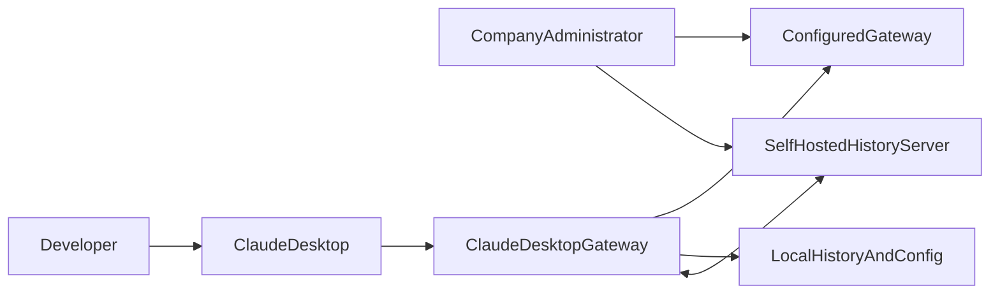
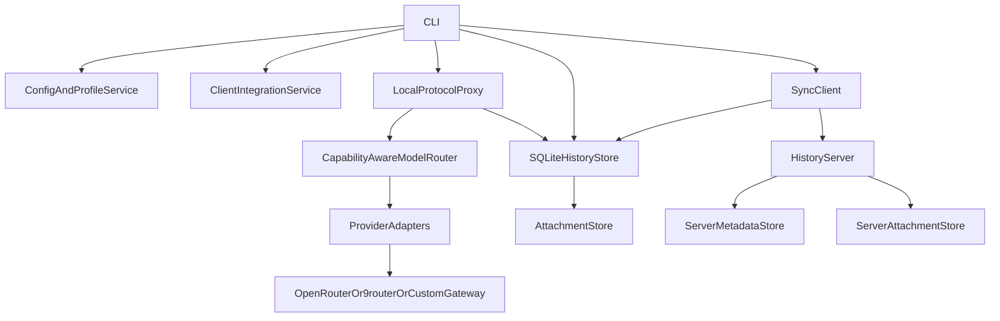
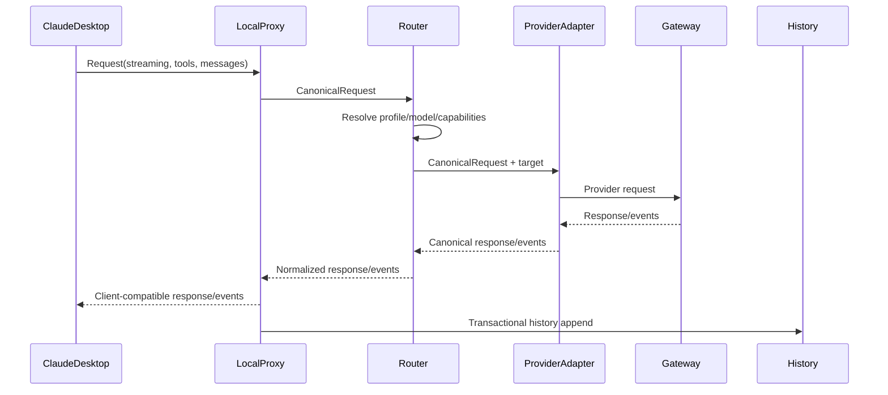

# Claude Desktop Gateway — Technical Design

> **Authoring model:** GPT-5.6 Luna  
> **Revision:** 2026-09-07 · Reviewed and revised by Claude Sonnet 4.6, 2026-09-07  
> **Status:** Revised — review recommendations applied  
> **Related requirements:** [requirements.md](requirements.md)  
> **Canonical architecture:** [docs/ARCHITECTURE.md](docs/ARCHITECTURE.md)

## 1. Design principles

1. **Configuration before mutation.** Parse and validate a complete effective
   configuration before changing a client file or starting a proxy.
2. **Adapters at boundaries.** Provider-specific headers, paths, payload
   differences, and error behavior stay behind adapter interfaces.
3. **Capability honesty.** Unknown support is not treated as support. Routing
   must not select a model that cannot satisfy required tool or streaming
   behavior.
4. **Portable data.** SQLite is an implementation store, not a lock-in format.
   Export/import is a first-class feature.
5. **Local-first operation.** Conversations and configuration remain useful
   offline; synchronization is an optional replication concern.
6. **Documentation as code.** Architectural facts and operational behavior are
   versioned with implementation changes.
7. **Safe failure.** Invalid input, unsupported client behavior, provider
   failure, and sync conflict must be visible and non-destructive.

## 2. Architecture decisions

| ID | Decision | Rationale |
|---|---|---|
| ADR-001 | Go monorepo with CLI, proxy, and server modes | One language and release pipeline; independently runnable processes remain possible. |
| ADR-002 | CLI first, GUI later | Makes all operations scriptable and avoids coupling stable domain APIs to a UI toolkit. |
| ADR-003 | TOML canonical configuration; `.env` for secrets/overrides | TOML represents profiles and nested routing clearly; `.env` remains familiar for secrets. |
| ADR-004 | Inbound proxy protocol conditional on T005 (ADR-011) | The inbound protocol surface (Anthropic Messages API, MCP, or none) is determined by verified Claude Desktop endpoint behavior recorded in ADR-011 before proxy coding begins. |
| ADR-005 | OpenAI-compatible upstream adapter contract | Covers OpenRouter, 9router, and custom gateways while isolating deviations. |
| ADR-006 | SQLite local history with portable export; sync deferred | Reliable transactions and queryability. Sync server is deferred to Phase 6; the local schema includes sync stubs from day one to avoid a disruptive migration. |
| ADR-007 | Content-addressed attachments outside SQLite | Avoids oversized rows and permits resumable transfer and deduplication. Checksums validated as hex strings before any filesystem path construction. |
| ADR-008 | Versioned sync objects and preserved conflicts | Prevents silent loss when devices diverge. |
| ADR-009 | Loopback-only local proxy by default | Reduces accidental LAN exposure of provider credentials and conversation traffic. Non-loopback binding logs a WARN. |
| ADR-010 | No binary patching or authentication circumvention | Keeps the project within supported configuration and user-controlled gateway boundaries. |
| ADR-011 | Claude Desktop endpoint verification result | **Pending T005.** Records the verified Claude Desktop integration mechanism (custom model endpoint, MCP only, or none), the Claude Desktop version and OS tested, and the resulting inbound proxy protocol decision. Status must be "Accepted" before Phase 3 coding begins. |

## 3. C4 system context



The system has two independent external data flows:

1. Model traffic: client → local gateway → selected provider.
2. History traffic: local store ↔ optional self-hosted history server.

The local gateway does not automatically replicate prompts to any service other
than the configured model provider and explicitly configured history server.

## 4. C4 containers



### Containers

#### CLI

Owns command parsing, output formatting, exit codes, and invocation of
application services. It must not contain provider translation or SQL business
logic.

#### Config and Profile Service

Loads TOML, resolves environment and secret references, validates profiles,
computes effective configuration, and emits redacted explanations.

#### Client Integration Service

Discovers supported Claude Desktop paths, renders the selected configuration
or override artifact, creates backups, performs atomic writes, restores
backups, and reports unsupported integration modes.

#### Local Protocol Proxy

Owns HTTP server lifecycle, request size limits, correlation IDs, inbound
protocol decoding, cancellation, streaming response delivery, and safe error
mapping.

#### Capability-Aware Model Router

Resolves source model/tier to a target model, checks capabilities, chooses
fallbacks, applies retry policy, and emits routing metadata.

#### Provider Adapters

Translate a canonical internal request to a provider protocol and translate
responses/events/errors back. Initial adapters are OpenAI-compatible,
OpenRouter configuration, and 9router configuration.

#### SQLite History Store

Persists conversations, records, branches, sync cursors, tombstones, audit
events, and schema migrations.

#### Attachment Store

Stores content-addressed blobs and metadata, enforces size/type limits, and
provides streaming reads/writes.

#### Sync Client

Creates idempotent push/pull batches, tracks cursors and pending operations,
handles retries, and records conflicts without merging data destructively.

#### History Server

Authenticates clients, validates sync objects, stores metadata and attachments,
enforces tenant/user authorization, and returns deterministic change pages.

## 5. Proposed repository layout

```text
cmd/
  claude-gateway/
    main.go
  gateway-server/
    main.go
internal/
  app/
  cli/
  config/
  secrets/
  clientintegration/
  proxy/
  protocol/
    inbound/       # sub-package name determined by ADR-011 (e.g., anthropic/ or mcp/)
    outbound/
      openai/
  routing/
  provider/
    openai/
    openrouter/
    nine/
  history/
  attachments/
  sync/
  server/
  audit/
  observability/
  platform/
pkg/
  api/
  model/
migrations/
testdata/
  protocol/
  providers/
  exports/
docs/
```

`internal/` packages are implementation details. `pkg/api` contains only
stable contracts that need to be shared by the CLI, server, or future GUI.

## 6. Configuration model

### 6.1 Example TOML

```toml
version = 1
active_profile = "company-cheap"

[profiles.company-cheap]
provider = "openrouter"
proxy_mode = "local"
history_mode = "local-and-remote"

[providers.openrouter]
base_url = "https://openrouter.ai/api"
protocol = "openai-compatible"
api_key_env = "OPENROUTER_API_KEY"
auth_scheme = "bearer"
timeout_seconds = 90
tls_verify = true

[providers.nine_router]
base_url = "https://example.invalid"
protocol = "openai-compatible"
api_key_env = "NINEROUTER_API_KEY"
auth_scheme = "bearer"

[models.deepseek_fast]
model_id = "provider/model-id"
display_name = "DeepSeek Fast"
tier_alias = "fast"
streaming = true
tool_calls = true
vision = false
reasoning = true
enabled = true

[profiles.company-cheap.routing]
default_tier = "balanced"
fallback_tiers = ["fast"]

[[profiles.company-cheap.routing.rules]]
source = "premium"
target_model = "deepseek_fast"

[history]
local_database = "~/.local/share/claude-gateway/history.db"
attachment_directory = "~/.local/share/claude-gateway/attachments"
redact_secrets = true

[sync]
enabled = false
server_url = "https://history.example.invalid"
token_env = "CLAUDE_GATEWAY_SYNC_TOKEN"
```

The example uses illustrative values only. A generated configuration must not
invent a live endpoint or claim that a model ID exists.

### 6.2 Resolution precedence

1. Built-in safe defaults.
2. Selected profile.
3. Explicit TOML values.
4. Declared environment overrides.
5. Secret references resolved at operation time.
6. Command-line flags that are explicitly overrideable.

The effective configuration object records the origin of each non-secret value.

### 6.3 Secret handling

The internal configuration object contains secret handles, not printable
secrets. A `SecretResolver` interface supports environment variables first and
allows OS keychain implementations later. Logging uses a redacting writer and
must never serialize authorization headers.

## 7. Canonical request pipeline



### 7.1 Canonical internal types

The canonical model should include:

- `RequestID`
- source client and workspace metadata
- source model and resolved target model
- system instructions
- ordered content blocks
- tool definitions
- tool calls and results
- streaming preference
- capability requirements
- cancellation/deadline
- safe usage metadata

The canonical response model should represent text deltas, reasoning deltas
where available, tool calls, usage, finish reason, provider warnings, and
terminal errors. Unknown provider fields may be retained in an explicitly
non-semantic extension map, subject to size limits.

### 7.2 Streaming rules

The adapter converts provider chunks into canonical events. The proxy converts
canonical events into the inbound protocol's event sequence. Every stream must
have:

1. a correlation ID,
2. zero or more content/tool events,
3. one terminal completion or error event,
4. cancellation cleanup.

Partial streams are recorded as incomplete records with an explicit status.

### 7.3 Tool rules

Tool schemas are validated before forwarding. The router checks the target's
tool capability. Tool results are treated as untrusted content and are not
executed by the gateway.

## 8. Provider adapter design

```go
type Adapter interface {
    Name() string
    Capabilities(ctx context.Context, target Target) (Capabilities, error)
    Send(ctx context.Context, req CanonicalRequest) (CanonicalResponse, error)
    Stream(ctx context.Context, req CanonicalRequest) (<-chan Event, error)
    Health(ctx context.Context) HealthResult
}
```

The exact package names may change during implementation, but the boundary
must remain testable without real network calls.

### OpenRouter

OpenRouter is represented as an OpenAI-compatible provider with configurable
base URL and optional site metadata headers. It must not hard-code a single
host, allowing a user-controlled compatible proxy to be selected.

### 9router

9router is treated as an external dependency. **The 9router adapter
(T039) is deferred until T006 records the verified 9router API contract in
`docs/API.md`.** If T006 records that 9router is OpenAI-compatible, T039
proceeds using the standard OpenAI adapter scaffolding. If T006 records
deviations, T039 becomes a custom adapter task. If the protocol is
incompatible and undocumented, T039 is deferred to Later Scope. No repository
code is copied into this project.

### Custom OpenAI-compatible gateway

The user supplies base URL, auth scheme, headers, protocol variant, and model
IDs. A custom gateway must be opt-in for insecure TLS and must pass a local
configuration validation step.

## 9. Claude Desktop integration

The integration is deliberately layered:

1. **Discovery:** locate the supported configuration file or accept a path.
2. **Snapshot:** validate and checksum the current file.
3. **Render:** produce a candidate configuration or override artifact.
4. **Diff:** show redacted changes.
5. **Apply:** backup, write atomically, validate result.
6. **Restore:** select and restore a prior snapshot.
7. **Probe:** verify that the client-visible endpoint behavior is actually
   supported; otherwise report an unsupported integration.

The design does not assume that Claude Desktop's developer mode provides a
general model endpoint override. That claim must be tested against the target
client version and documented in ADR-011 as supported, experimental, or
unavailable.

> **Important — MCP vs. Model Endpoint distinction.** Claude Desktop has
> documented support for MCP (Model Context Protocol) servers via
> `claude_desktop_config.json`. MCP is a JSON-RPC 2.0 protocol over stdio or
> SSE that serves *tool and context* traffic — it is NOT a model inference
> endpoint. The Anthropic Messages API (`POST /v1/messages`) is a completely
> separate HTTP REST interface for model inference. This section addresses
> model inference routing only. T005 must explicitly confirm which mechanism
> Claude Desktop exposes before any proxy coding begins. If T005 confirms
> MCP-only integration, the proxy design's inbound API must be revised to
> target MCP protocol rather than the Anthropic Messages API.

## 10. History data model

Core entities:

- `workspace`: stable local/project identity and display metadata.
- `session`: client run context and device identity.
- `conversation`: logical conversation and current branch pointer.
- `conversation_branch`: parent/branch relationship and version.
- `message`: role, ordered content, status, timestamps, and source metadata.
- `content_block`: text, reasoning, tool-use, tool-result, or attachment ref.
- `model_invocation`: provider, source model, target model, usage, and outcome.
- `attachment`: content hash, size, MIME type, path/object key, and encryption.
- `sync_object`: entity ID, version, checksum, tombstone, and sync state.
- `audit_event`: safe record of local mutations.

The schema must use stable IDs generated locally, UTC timestamps, integer
schema versions, and explicit nullable fields rather than overloaded JSON
where queries or integrity constraints matter.

## 11. Export/import format

The portable archive should be a ZIP-like container with:

```text
manifest.json
conversations.jsonl
messages.jsonl
model-invocations.jsonl
attachments/<sha256>
checksums.txt
```

`manifest.json` identifies format version, creation time, source installation
ID, included IDs, encryption/redaction mode, and checksums. Import writes to a
staging area, validates everything, then commits in one database transaction
where practical.

## 12. Synchronization protocol

> **Phase 6 — Deferred from initial scope.** The sync server and client are
> not required for MVP. The local history schema includes sync-cursor and
> tombstone stub columns (T093) from the initial migration so that Phase 6
> can activate sync behavior without DDL changes to production tables. The
> design below remains the target architecture for Phase 6 implementation.

### 12.1 Client operations

- `GET /v1/sync/changes?cursor=...`
- `POST /v1/sync/push`
- `POST /v1/sync/ack`
- `GET /v1/attachments/{hash}`
- `PUT /v1/attachments/{hash}`
- `GET /v1/health`

These are design-level endpoints, not a claim that implementation already
exists. The final API documentation must define authentication, pagination,
limits, error bodies, idempotency keys, and version negotiation.

### 12.2 Sync algorithm

1. Read local pending objects in deterministic order.
2. Create a batch with idempotency key and object checksums.
3. Send metadata and attachment manifests.
4. Upload missing attachments with resumable bounded chunks.
5. Server validates authorization, schema, parent versions, and checksums.
6. Server accepts, rejects, or returns conflicts per object.
7. Client records accepted versions and preserves conflicts as branches.
8. Pull remote changes after the last acknowledged cursor.
9. Apply non-conflicting changes transactionally.
10. Advance cursor only after local application succeeds.

### 12.3 Conflict model

A conflict occurs when the client writes against a stale parent version.
Neither side is silently discarded. The client creates a conflict branch with
references to both versions and exposes it through `history conflicts`.

## 13. Server security model

The server must be designed for a user-controlled deployment:

- TLS termination is required in production.
- Authentication is token-based in the first slice, with an interface for
  OIDC later.
- Every request is authorized against user and tenant scope.
- Provider API keys are never accepted as sync-server credentials.
- Request bodies, attachments, and batch sizes are bounded.
- URLs supplied as provider endpoints are subject to SSRF policy.
- Database backups and attachment backups are documented separately.
- Health endpoints expose readiness, not credentials or stored content.

## 14. Error taxonomy

Errors must be classified into stable categories:

- `invalid_config`
- `unsupported_client_integration`
- `unsupported_capability`
- `provider_auth`
- `provider_rate_limit`
- `provider_transient`
- `provider_protocol`
- `request_cancelled`
- `history_conflict`
- `sync_auth`
- `sync_checksum`
- `storage`
- `internal`

Each error has a user-safe message, machine-readable code, retryability,
correlation ID, and optional redacted provider context.

## 15. Deployment

### Local-only

The user runs `claude-gateway proxy` and the client. SQLite and attachments
remain on the machine. No server is required.

### Client plus self-hosted server

The user runs the local CLI/proxy and a separate `gateway-server` process.
The server uses a database and attachment directory, sits behind TLS, and is
backed up by the operator.

### Company distribution

An administrator distributes a signed binary, a non-secret profile template,
and instructions for supplying per-user credentials. Profiles are immutable
or policy-controlled only when the administrator explicitly enables policy
mode.

## 16. Build and release

- Build targets: `windows/amd64`, `linux/amd64`.
- Version metadata is embedded at build time.
- Release archives include binary, checksum, license, quickstart, and
  configuration examples.
- CI runs unit, integration, protocol fixture, race, static analysis, and
  cross-build checks.
- Release artifacts must not contain development keys or test history.

## 17. Design verification checklist

- [ ] Every public command has an API/service boundary.
- [ ] Every provider-specific field is isolated in an adapter.
- [ ] Streaming and tool events have golden fixtures.
- [ ] Client writes are backed up, atomic, and restorable.
- [ ] SQLite migrations are forward-tested.
- [ ] Export/import is checksum-verified and non-destructive.
- [ ] Sync is idempotent and conflict-preserving.
- [ ] Logs and errors are secret-safe.
- [ ] Loopback and TLS defaults are enforced.
- [ ] Unsupported Claude Desktop behavior is reported rather than guessed.
- [ ] Architecture changes update `docs/ARCHITECTURE.md` and decisions update
  `docs/DECISIONS.md`.
