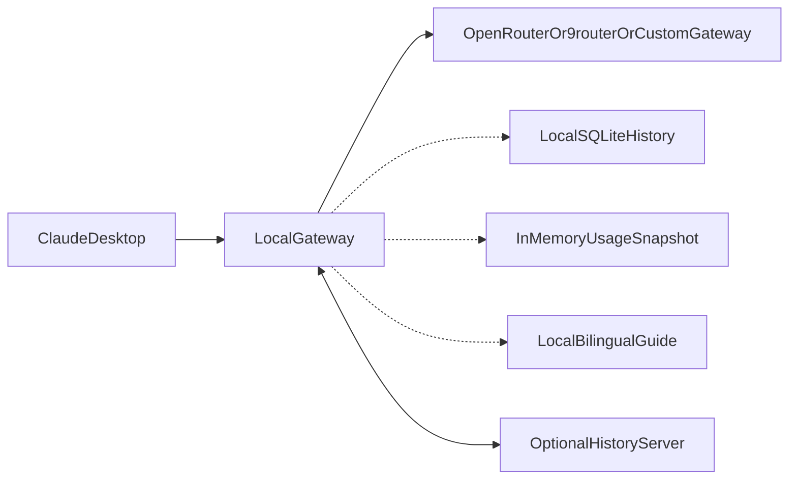

# Architecture

> **Authoring model:** GPT-5.6 Luna  
> **Revision:** 2026-09-11 · Fail-open sidecars (ADR-014) added by Cursor Grok 4.6  
> **Status:** Canonical baseline — revised

## System boundary

The system contains a CLI, optional local protocol proxy, provider adapters,
local SQLite history, content-addressed attachments, an in-memory usage
snapshot for the local guide, and an optional remote history server. Claude
Desktop and configured gateways are external systems.

## Package boundaries

- `cmd/`: process entrypoints only.
- `internal/cli`: command parsing and presentation.
- `internal/config`: loading, resolution, validation.
- `internal/clientintegration`: backup, render, apply, restore.
- `internal/proxy`: HTTP lifecycle and middleware.
- `internal/protocol/inbound/<mechanism>`: inbound protocol codec. The
  `<mechanism>` sub-package name is determined by ADR-011 after T005
  verification (e.g., `anthropic` for Anthropic Messages API, `mcp` for MCP
  tool-server protocol). No files are created under this path until ADR-011
  is accepted.
- `internal/protocol/outbound/openai`: outbound OpenAI-compatible codec.
- `internal/routing`: model selection and capability policy.
- `internal/provider`: upstream adapter contracts and implementations.
- `internal/history`: SQLite domain persistence.
- `internal/attachments`: content-addressed blobs.
- `internal/sync`: local queue and synchronization client.
- `internal/server`: remote HTTP server and authorization.
- `internal/platform`: OS-specific paths/process behavior.

Business logic must remain outside CLI handlers. Provider-specific behavior
must remain behind adapter interfaces. The future GUI will call application
services rather than duplicate domain logic.

## Data flows

Model flow: Claude Desktop → local proxy → canonical request → router →
provider adapter → upstream gateway → canonical events → local protocol
encoder → Claude Desktop.

History flow: proxy/domain event → SQLite transaction → optional export or
sync queue → authenticated server → versioned remote object. History open and
append are sidecars (ADR-014): failure logs WARN and must not fail
`POST /v1/messages`.

Usage snapshot flow: after a completed/incomplete response, in-memory ring +
session totals → `GET /debug/usage` → local guide card. No prompts. Snapshot
errors degrade to empty JSON.

## Trust boundaries

1. Client to local proxy: local process boundary; loopback by default.
   Non-loopback binding logs a WARN and requires explicit configuration.
2. Local proxy to provider: external network and provider trust boundary.
   TLS 1.2 minimum enforced; SSRF policy blocks private/loopback URLs at
   config-validation time (T016) and runtime (T040).
3. Local client to history server: TLS/authentication boundary.
4. Server to provider endpoints: SSRF and administrator policy boundary.
   Server-side SSRF policy layer (T101) applies for company deployments.
5. User content to logs: privacy boundary; prompt and tool-result content
   excluded by default; tool results escaped in structured log fields.
6. Administrator to history server: authenticated management traffic.
   Profile templates and policy configuration must not contain inline secrets.

## Concurrency model

One goroutine per streaming proxy request. The HTTP server's request
`context.Context` is the cancellation root. Router and adapter layers must
accept and forward the context. When the client disconnects mid-stream, the
HTTP server cancels the request context; the router and adapter must respect
context cancellation before sending on the event channel. The history writer
uses a separate goroutine and a context that is not the request context, so
an in-progress database write is not cancelled by a client disconnect and
cannot block encoding the client response. Sidecar hooks (`OnRequest`,
catalog refresh, spend alerts) recover from panic; a full sidecar queue
drops the event.

The streaming event channel is unbuffered. The adapter must not block
indefinitely on a cancelled context. Every streaming goroutine must terminate
within the request context deadline plus a configured drain timeout.

## Change rule

Any change to a package boundary, trust boundary, data flow, protocol contract,
deployment mode, concurrency model, or persistence model requires updating this
file and `DECISIONS.md` in the same task.
